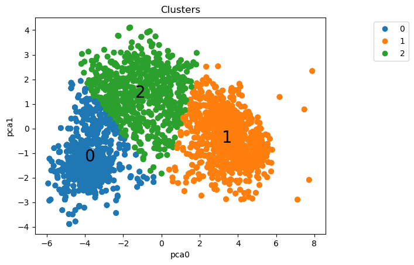

[](https://www.linkedin.com/in/zeygler-oliveira-a021a92a4/)
[](https://www.python.org/)

# Case iFood - Analista de dados

Considere uma empresa bem estabelecida que atua no setor de varejo de alimentos. Atualmente, eles têm cerca de vários milhares de clientes registrados e atendem quase um milhão de consumidores por ano. Eles vendem produtos de 5 grandes categorias: vinhos, carnes, frutas exóticas, peixes especialmente preparados e produtos doces. Estes podem ser divididos ainda mais em produtos de gold e regulares. Os clientes podem encomendar e adquirir produtos por meio de 3 canais de vendas: lojas físicas, catálogos e site da empresa. Globalmente, a empresa teve receitas sólidas e uma linha de fundo saudável nos últimos 3 anos, mas as perspectivas de crescimento dos lucros para os próximos 3 anos não são promissoras... Por esse motivo, várias iniciativas estratégicas estão sendo consideradas para inverter essa situação. Um deles é melhorar o desempenho das atividades de marketing, com foco especial em campanhas de marketing.


Baseado no processo seletivo para Analista de Dados do iFood disponível [neste repositório.](https://github.com/ifood/ifood-data-business-analyst-test)


<p align="center"> 
  <a href="https://www.linkedin.com/in/zeygler-oliveira-a021a92a4/" target="_blank"></a> 
</p>


## Objetivos
Construir um modelo preditivo que apoiará iniciativas de marketing direto e que produza o maior lucro para o próxima campanha de marketing direto, programada para o próximo mês. Desejavelmente, o sucesso dessas atividades provará o valor da abordagem e convencerá os mais céticos dentro da empresa.


Objetivos detalhados:

- Construir uma análise exploratória robusta.
- Segmentar os clientes e identificar característica similares.
- Construir um modelo de classificação para prever se um cliente irá comprar o produto oferecido na campanha.
- Apresentar uma estrutura de projeto detalhado e bem organizado a ser apresentado a partes técnicas interessadas.
- Responder perguntas do negócio e oferecer um direcionamento para equipe de marketing.

## Estrutura do repositório

O repositório está estruturado da seguinte forma:

```
├── case
├── data
├── images
├── notebooks
├── reports
```

- Na pasta `data` estão os dados utilizados no projeto. O arquivo `ml_project1_data.csv` é o dataset utilizado originalmente. Os demais arquivos são os datasets gerados durante o projeto.
- Na pasta `images` estão as imagens dos gráficos desenvolvidos durante o projeto.
- Na pasta `notebooks` estão os notebooks organizados do projeto:
  - [`00_package_versions.ipynb`](https://github.com/ZeyOliveira/ifood_case_data_analyst/blob/main/notebooks/00_package_versions.ipynb): Versões dos principais pacotes utilizados neste projeto.
  - [`01_eda.ipynb`](https://github.com/ZeyOliveira/ifood_case_data_analyst/blob/main/notebooks/01_eda.ipynb): notebook que fizemos a Análise Exploratória de Dados, criação de novas features e o desenvolvimento de alguns gráficos para entendimento.
  - [`02_clustering.ipynb`](https://github.com/ZeyOliveira/ifood_case_data_analyst/blob/main/notebooks/02_clustering.ipynb): Neste notebook foi feito um estudo do comportamento dos dados no gráfico com o objetivo de saber qual o melhor pré-processamento mais adequado para cada coluna; Em seguida, foi feito a clusterização e algumas visualizações.
  - [`03_clustering_pca.ipynb`](https://github.com/ZeyOliveira/ifood_case_data_analyst/blob/main/notebooks/03_clustering_pca.ipynb)): Alguns códigos do notebook anterior foi reaproveitado. A novidade nesse notebook foi a utilização do PCA para redução de dimensionalidade.
  - [`04_classification.ipynb`](https://github.com/ZeyOliveira/ifood_case_data_analyst/blob/main/notebooks/04_classification.ipynb)): Aqui foi testado alguns modelos de classificação, que foram avaliados e o modelo selecionado para dar continuidade ao projeto foi o LogisticRegression.
  - [`05_classification_logreg.ipynb`](https://github.com/ZeyOliveira/ifood_case_data_analyst/blob/main/notebooks/05_classification_logreg.ipynb)): Para finalizar o projeto foi feito a otimização de hiperparâmetros no SelectKBest e no LogisticRegression, e o modelo foi novamente avaliado, assim foi obtido o resultado final.
  - [`auxiliary_functions.py`](https://github.com/ZeyOliveira/ifood_case_data_analyst/blob/main/notebooks/auxiliary_functions.py): Arquivo com funções auxiliares usados no projeto.
- Na pasta `reports` estão os relatórios gerados durante o projeto utilizando a biblioteca [ydata-profiling](https://github.com/ydataai/ydata-profiling).

## Detalhes do dataset utilizado e resumo dos resultados

Uma descrição detalhada do dataset utilizado está disponível [aqui](data/README.md).<br>
Com um pipeline com pré-processamento, PCA e K-Means, a base foi segmentada em 3 clusters:



Análise por cluster:

- Cluster 0: 
  - Renda alta 
  - gasto alto 
  - muito provalmente não tem filhos
  - mais propenso a aceitar campanhas
  - cluster sem pessoas com escolaridade básica
  - sem um perfil de idade que se destaque

- Cluster 1: 
  - Renda baixa 
  - gasto baixo 
  - provalmente tem filhos
  - baixa propensão a aceitar campanhas
  - único cluster com porcentagem significativa de pessoas com escolaridade básica
  - pessoas mais jovens

- Cluster 2: 
  - Renda intermediária
  - gasto intermediário
  - provalmente tem filhos
  - pode aceitar campanhas
  - pessoas com idade mais elevada

Posteriormente, três modelos de classificação foram treinados para prever se um cliente irá comprar o produto oferecido na campanha. Os modelos utilizados foram:

- Regressão Logística
- Decision Tree
- KNN

Um DummyClassifier foi utilizado como baseline. Os modelos foram comparados com base em 6 métricas:


Com base nessa comparação, o modelo de Regressão Logística foi escolhido para passar por uma otimização de hiperparâmetros. 

## Como reproduzir o projeto

O projeto foi desenvolvido utilizando o Python 3.10.12 Para reproduzir o projeto, crie um ambiente virtual com o Conda, ou ferramenta similar, com o Python 3.10.12+ e instale as bibliotecas abaixo:

| Biblioteca       | Versão |
| ---------------- | ------ |
| Imbalanced-Learn | 0.10.1 |
| Matplotlib       | 3.7.1  |
| NumPy            | 1.25.2 |
| Pandas           | 1.5.3  |
| Scikit-Learn     | 1.2.2  |
| Seaborn          | 0.13.1 |

Python version: 3.10.12


Essas são as bibliotecas principais utilizadas no projeto. O relatório foi gerado com a biblioteca [ydata-profiling](https://github.com/ydataai/ydata-profiling), instale-a se quiser reproduzir o relatório. Para ter um gráfico em 3 dimensões interativo, instale a biblioteca [ipympl](https://matplotlib.org/ipympl/).
